# WarehouseSystem using Qt5
This is a basic graphical warehous system that was built using Qt5. The aim of this project is to practice the different classes and design models from Qt5. The system mainly has two modes:
- Admin: in this mode, the user can add new users, products and zones as well as removing them. 
- Staff: in this mode, the user can only perform three functions. Add or disptach stock and view the current stock. These functions are also enabled in the admin mode.

The system is far from perfect and missing a lot of features however it satisfies its purpose.

## Used Qt5 classes
- QMainWindow 
- QDialog
- QWidget
- QMessageBox
- QLineEdit
- QPushButton
- QComboBox
- QRadioButton
- QTableWidget

## Databse
The system uses SQLIT3 database and uses sqlit3.h API. 

## To build and try
You need to clone the repository and build it using Qt5 Creator as no standalone build is provided at the moment. 

## Login: ID and Password
For admin mode: 
- ID: person_27
- Password: admin

For staff mode:
- ID: person_28
- Password: staff

## Features
### Login window:

According to the type of the user, the user will be redirected after successfull login to the admin or the staff window.

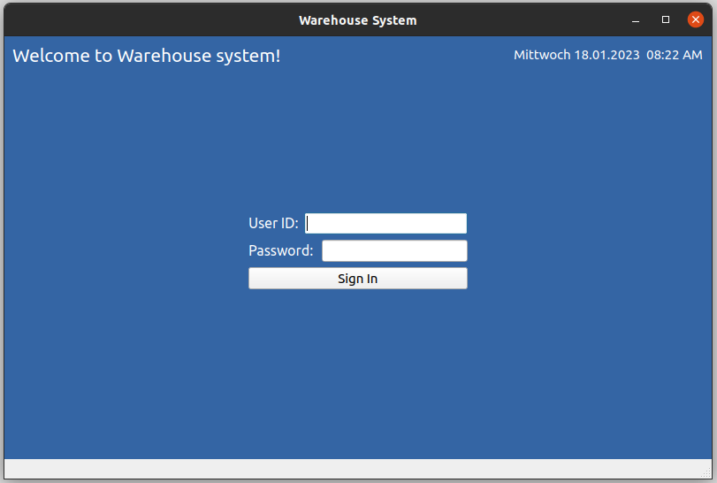

### Admin window:

This is the control window where the user has full control of the system and can add or remove users, products, and zones as well as adding or dispatching stock and generating reports.

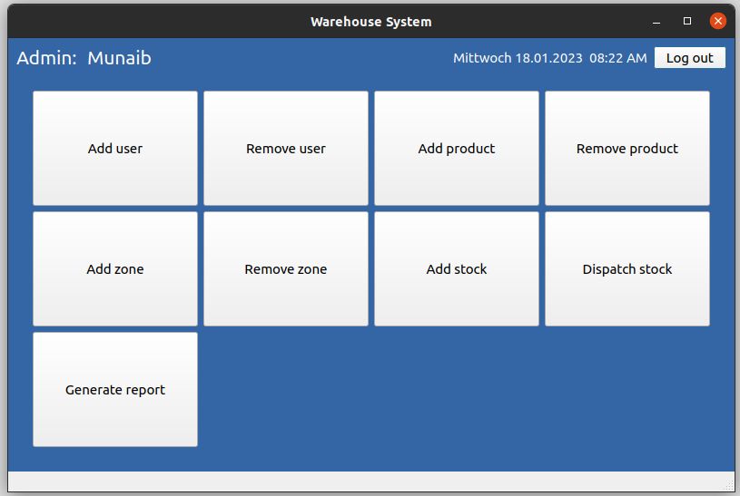

### Staff window:

This is a limited control window where the user can only add or dispatch stock as well as view the current stock in the system.

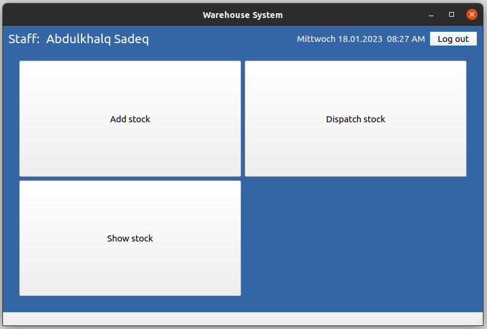

### Add new user

This dialog enables the admin to add new users to the system.

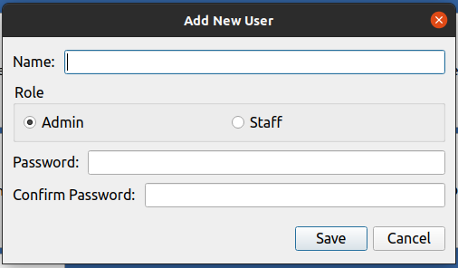

### Remove user

This dialog enables the admin to remove a user from the system.

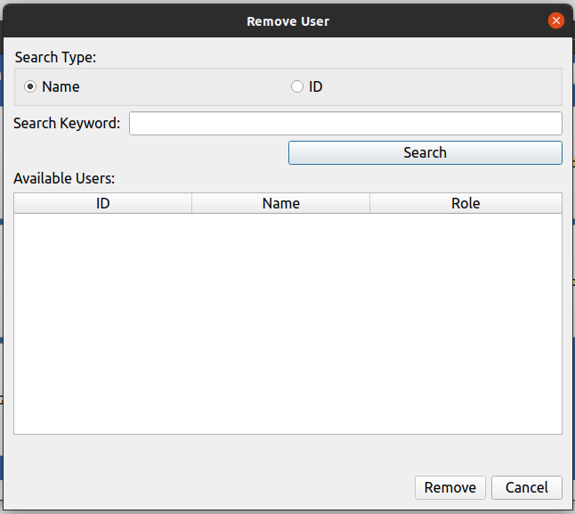

### Add new product

This dialog enables the admin to add new products to the system.

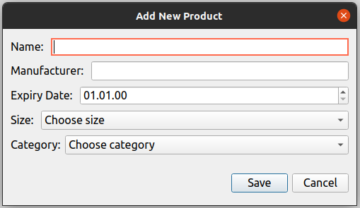

### Remove product

This dialog enables the admin to remove products from the system.
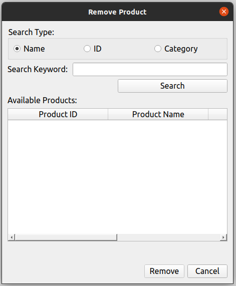

### Add new zone 

This dialog enables the admin to add new zones to the system.

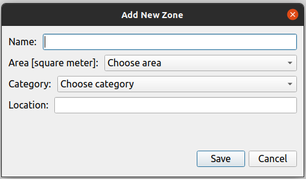

### Add stock

This dialog enables the admin as well as the staff to add stock to the system.
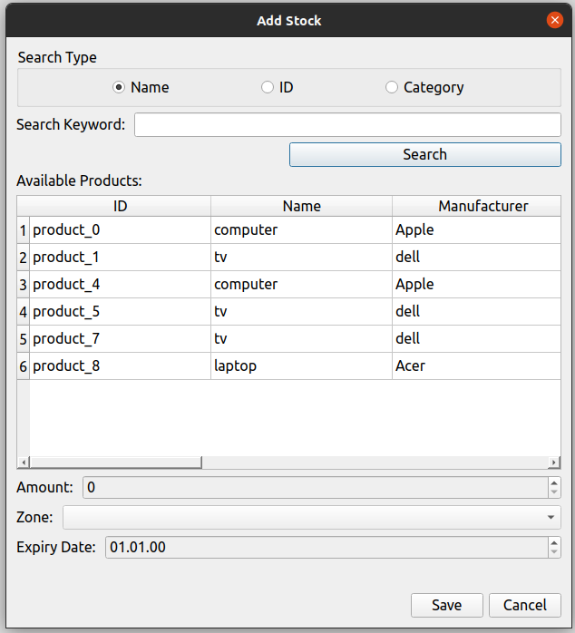

### Dispatch stock

This dialog enables the admin as well as the staff to dispatch stock from the system.
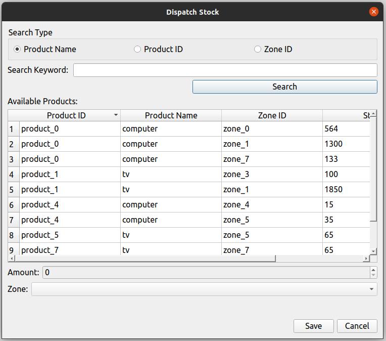

### Show available stock

This dialog enables the staff to view the current stock in the system. It is a limited form of the report function in the admin window.

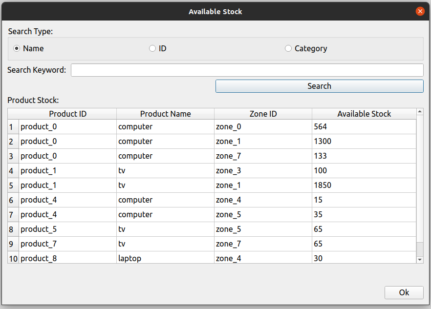

### Generate report

This dialog enables the admin to generate and export (not implemented yet) the reports based on product, zone, or in general. 

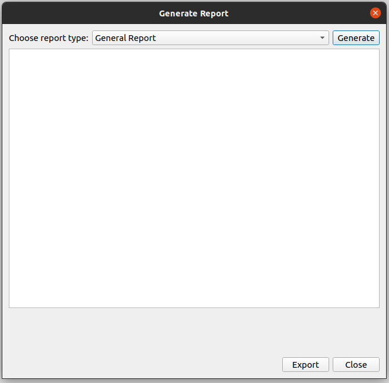

## What could be next:
- Improve UI with icons and colors
- Add new features such as profile configuration and password change
- Add customized reports
- Add and dispatch stock from receipts.
- Add suppliers and customers
- Encript password 
- Improve database tables 
- .
- .
- .

